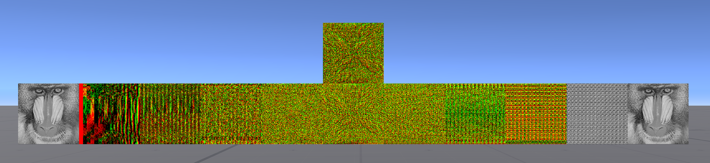
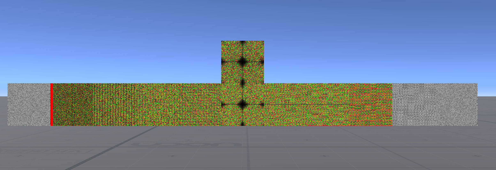
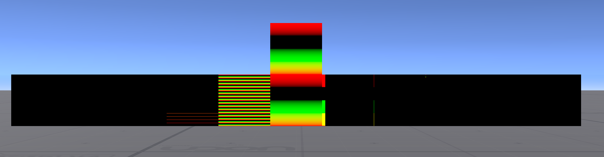

## FFT on the GPU

This is an optimized GPU-based 2D FFT for VRChat. Since it uses RenderTextures,
it is only suitable for use in worlds.

### Quick start

Clone the repo into your unity project. Open the scene.

Run CPU simulator:

```bash
$ cmake .. && cmake --build . && ./gpu_fft
```

Generate twiddle factor tables:

```bash
$ python3 ./generate_twiddle_tables.py
```

### Overview

`gpu_fft.cc` is a CPU simulator achieving high performance. It compares the GPU
algorithm against a simple radix-2 algorithm, demonstrating agreement within
some modest epsilons. Because higher radix FFTs do more sequential adds than
lower ffts, there is substantial error. In exchange, higher radices let you
compute FFTs with a shorter CRT chain.

`generate_twiddle_tables.py` generates precomputes twiddle factors.
`DFT_MATRIX` corresponds to `ShaderUniforms.twiddle_factors` in the simulator
and `STAGE_TWIDDLES` corresponds to `ShaderUniforms.stage_twiddles`.

### Gallery

Each of these images shows the following, from left to right:

1. Original image.
1. FFT stage 0.
2. FFT stage 1.
3. FFT stage 2.
4. FFT stage 3.
5. FFT bit reversal. Numpy reference image is shown above.
6. IFFT stage 0.
7. IFFT stage 1.
8. IFFT stage 2.
9. IFFT stage 3.
10. IFFT bit reversal. The original signal is recovered.






